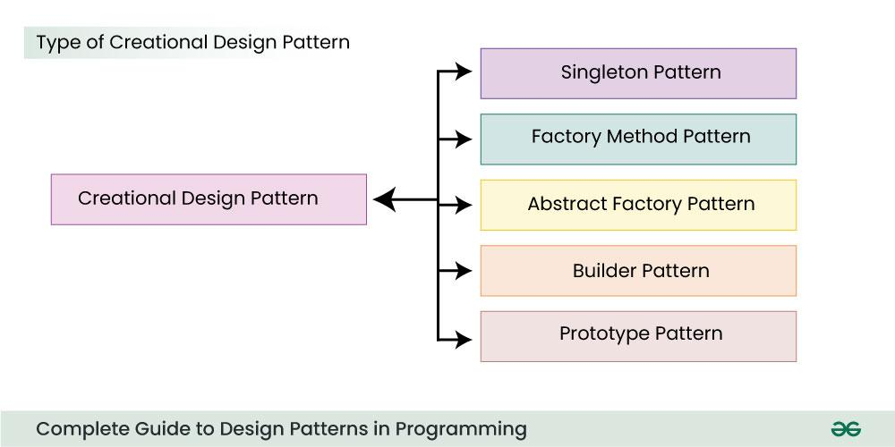

## design pattern
 * A design pattern in Java (or any programming language) is a general, reusable solution to a commonly occurring 
 problem in software design. It is a template for solving problems that can be adapted to various situations

**1. Creational Design Patterns**

   * Purpose: Deal with object creation mechanisms, trying to create objects in a manner suitable to the situation.

     * Singleton: Ensures that a class has only one instance and provides a global point of access to it.
     * Factory Method: Provides an interface for creating objects but lets subclasses decide which class to instantiate.
     * Abstract Factory: Creates families of related or dependent objects without specifying their concrete classes.
     * Builder: Separates the construction of a complex object from its representation, allowing step-by-step creation.
     * Prototype: Creates new objects by copying an existing object (cloning).
**2. Structural Design Patterns**
   Purpose: Focus on how classes and objects are composed to form larger structures while keeping the system flexible and efficient.
   Patterns:
   Adapter: Bridges the gap between two incompatible interfaces.
   Bridge: Decouples an abstraction from its implementation, allowing them to vary independently.
   Composite: Composes objects into tree structures to represent part-whole hierarchies.
   Decorator: Adds additional functionality to an object dynamically.
   Facade: Provides a simplified interface to a larger body of code.
   Flyweight: Reduces memory usage by sharing as much data as possible with similar objects.
   Proxy: Provides a surrogate or placeholder to control access to another object.

A design pattern in Java (or any programming language) is a general, reusable solution to a commonly occurring problem in software design. It is a template for solving problems that can be adapted to various situations but is not a finished design that can be directly converted into code.

Categories of Design Patterns
Design patterns are broadly classified into three main categories:

1. Creational Design Patterns
   Purpose: Deal with object creation mechanisms, trying to create objects in a manner suitable to the situation.
   Patterns:
   Singleton: Ensures that a class has only one instance and provides a global point of access to it.
   Factory Method: Provides an interface for creating objects but lets subclasses decide which class to instantiate.
   Abstract Factory: Creates families of related or dependent objects without specifying their concrete classes.
   Builder: Separates the construction of a complex object from its representation, allowing step-by-step creation.
   Prototype: Creates new objects by copying an existing object (cloning).
2. Structural Design Patterns
   Purpose: Focus on how classes and objects are composed to form larger structures while keeping the system flexible and efficient.
   Patterns:
   Adapter: Bridges the gap between two incompatible interfaces.
   Bridge: Decouples an abstraction from its implementation, allowing them to vary independently.
   Composite: Composes objects into tree structures to represent part-whole hierarchies.
   Decorator: Adds additional functionality to an object dynamically.
   Facade: Provides a simplified interface to a larger body of code.
   Flyweight: Reduces memory usage by sharing as much data as possible with similar objects.
   Proxy: Provides a surrogate or placeholder to control access to another object.
**3. Behavioral Design Patterns**
   Purpose: Focus on communication between objects and how responsibilities are distributed among them.
   Patterns:
   Chain of Responsibility: Passes a request along a chain of handlers until one of them handles it.
   Command: Encapsulates a request as an object, allowing parameterization and queuing of requests.
   Interpreter: Defines a grammatical representation for a language and provides an interpreter to deal with it.
   Iterator: Provides a way to access elements of a collection sequentially without exposing its underlying representation.
   Mediator: Reduces direct communication between objects by introducing a mediator.
   Memento: Captures and restores an object's internal state without violating encapsulation.
   Observer: Defines a one-to-many dependency, so when one object changes state, all dependents are notified.
   State: Allows an object to change its behavior when its internal state changes.
   Strategy: Defines a family of algorithms and makes them interchangeable at runtime.
   Template Method: Defines the skeleton of an algorithm, allowing subclasses to override specific steps without changing the algorithm's structure.
   Visitor: Separates an algorithm from an object structure it operates on by adding new operations.

### Facade Design pattern:-
The Facade design pattern is a structural pattern that provides a simplified interface to a complex system. 
The pattern hides the complexity of the system and provides a unified interface for the client to interact with.
Other hands:-> Create client specific simple subsystem from complex system

