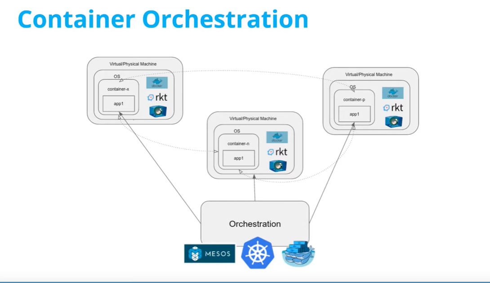
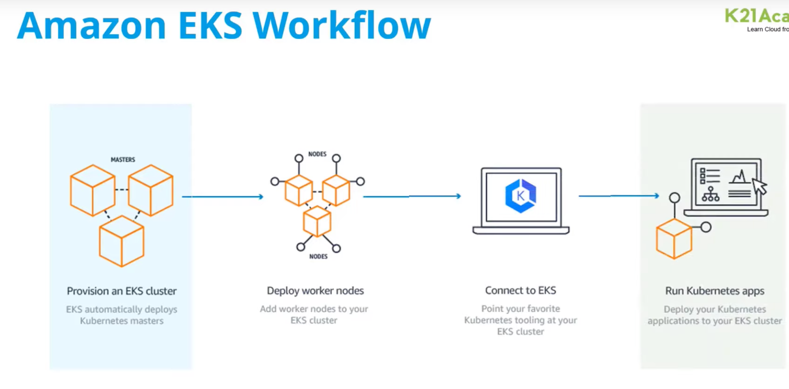

### (Amazon EKS)
* **Kubernetes is container orchestration and Management tool**

Amazon Elastic Kubernetes Service (Amazon EKS) is a fully managed Kubernetes service provided by Amazon Web Services (AWS).
It simplifies the process of running Kubernetes on AWS by removing the need for users to install,
operate, and maintain their own Kubernetes control plane. With Amazon EKS, users can easily create and manage Kubernetes clusters,
which are made up of a group of worker nodes that run containerized applications.
Amazon EKS provides a highly available and scalable Kubernetes control plane that is integrated with other AWS services,
such as Elastic Load Balancing, Auto Scaling, and Identity and Access Management (IAM).

### VPC
* Virtual private cloud (network)

### Subnet
* Virtual Private Cloud (VPC) networks are global resources. Each VPC network consists of one or more IP address ranges called subnets. 
Subnets are regional resources.