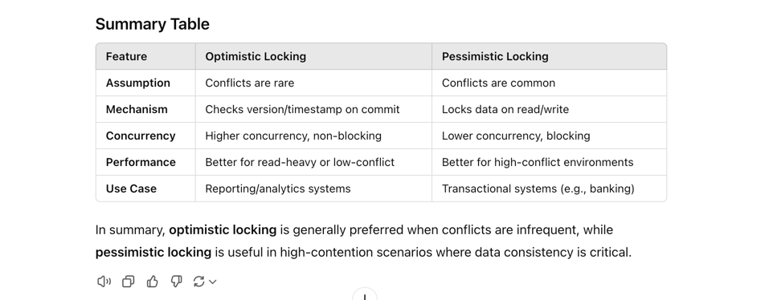

### 1)Second-highest salary
```sql
SELECT MAX(CustomerID) AS second_highest_ID
FROM Customers
WHERE CustomerID < (SELECT MAX(CustomerID) FROM Customers);
```
### Nth Highest salary(column)
```sql
SELECT * 
FROM Customers 
--GROUP BY SAL 
ORDER BY SAL DESC 
LIMIT 1 OFFSET n-1;
```

### Joining in SQL 
SQL joining is the process of combining rows from two or more tables based on a related column between them.
There are different types of joins in SQL, including:

[1] INNER JOIN: returns only the matching rows between two tables.
[2] LEFT JOIN: returns all the rows from the left table and matching rows from the right table.
[3] RIGHT JOIN: returns all the rows from the right table and matching rows from the left table.
[4] FULL OUTER JOIN: returns all the rows from both tables, with NULL values for non-matching rows.
[5] CROSS JOIN: returns the Cartesian product of the rows from both tables.
When joining tables, we specify the columns to join on using the JOIN keyword and the ON keyword. 
The syntax for an inner join is as follows:
```sql
SELECT *
FROM table1
INNER JOIN table2
ON table1.column_name = table2.column_name;
```


### Group By
The GROUP BY statement is often used with aggregate functions (COUNT(), MAX(), MIN(), SUM(), AVG()) to group,
the result-set by one or more columns.

### HAVING
The HAVING clause was added to SQL because the WHERE keyword cannot be used with aggregate functions.

### Index 
In SQL, you can create an index using the CREATE INDEX statement. An index is a data structure that improves.,
the speed of data retrieval operations on database tables by providing faster access to data.
Here's the syntax for creating an index in SQL:
```sql
CREATE INDEX index_name
ON table_name (column_name1, column_name2, ...);

CREATE INDEX idx_customers_name ON Customers (CustomerName);

SELECT * FROM Customers WHERE CustomerName = 'John Smith';
```
**Two types of indexes:-**
1) Clustered indexes
2) Non-clustered indexes

## ACID principle
The ACID principle is a set of properties that guarantee reliable processing of database transactions, ensuring the integrity and consistency of the database. ACID stands for Atomicity, Consistency, Isolation, and Durability. Let's break down each component:

1. Atomicity
   Definition: Atomicity ensures that a transaction is treated as a single, indivisible unit of work. This means that either all the operations within the transaction are completed successfully, or none of them are.
   Example: Consider a bank transfer where money is debited from one account and credited to another. Atomicity ensures that both operations (debit and credit) succeed together. If one fails, the entire transaction is rolled back, so no partial updates are made.
2. Consistency
   Definition: Consistency ensures that a transaction takes the database from one valid state to another, maintaining the integrity of the data according to predefined rules (constraints, triggers, etc.).
   Example: If a database has a constraint that ensures a bank account balance cannot go below zero, the consistency principle ensures that no transaction will violate this rule, even temporarily.
3. Isolation
   Definition: Isolation ensures that transactions are executed in isolation from each other, meaning that the operations within a transaction are not visible to other transactions until the transaction is committed. This prevents transactions from interfering with each other.
   Example: If two transactions are trying to update the same account balance simultaneously, isolation ensures that one transaction's changes are not visible to the other until the first transaction is complete, preventing conflicts and ensuring data integrity.
4. Durability
   Definition: Durability guarantees that once a transaction has been committed, it will remain in the system, even in the event of a system failure (e.g., power outage, crash).
   Example: After a successful bank transfer, the changes made to the account balances are permanently stored in the database. Even if the system crashes immediately after the transaction, the changes will be preserved when the system is restored.
   
5. Summary:
   Atomicity: All or nothing execution.
   Consistency: Valid state transitions.
   Isolation: Independent transaction execution.
   Durability: Permanent storage of committed changes.

6. In database systems and concurrent programming, optimistic and pessimistic locking are two strategies for handling concurrent access to shared 
   resources or data to prevent conflicts and ensure consistency.

 * Optimistic Locking
   Optimistic Locking assumes that multiple transactions can complete without conflict and only checks for conflicts before committing changes.
   This approach is based on the assumption that conflicts are rare, so it allows transactions to proceed without locking the data for the duration of the transaction. Instead, it verifies that no other transaction has modified the data before making a change.

How it works:
Each record has a version number or timestamp.
When a transaction reads data, it also reads the version.
When the transaction attempts to write, it checks the version again.
If the version hasn't changed, the update is allowed, and the version is incremented.
If the version has changed, indicating another transaction modified the data, the current transaction is rolled back and typically retried.
**Pros:**
No locking required, which reduces contention and improves performance, especially in read-heavy or low-conflict environments.
Better suited for environments where data contention is rare (e.g., analytics or reporting).
**Cons:**
Potential retries or rollbacks if conflicts are detected, which may impact performance in high-conflict environments.
Example:
In Java, @Version annotation with JPA/Hibernate can be used to implement optimistic locking:

```java
@Entity
public class Product {
@Id
private Long id;

    @Version  // Used to implement optimistic locking
    private int version;

    private String name;
    private int quantity;

    // Getters and setters
}
```
   * Pessimistic Locking
    Pessimistic Locking assumes that conflicts are likely, so it prevents other transactions from accessing data that a transaction is working with. This is done by locking the data as soon as a transaction starts. Any other transaction that tries to access the locked data is blocked until the lock is released, thus avoiding conflicts by preventing concurrent access.

How it works:
When a transaction reads data, it applies a lock to that data.
The lock prevents other transactions from reading or writing to the locked data until the lock is released (usually at the end of the transaction).
This ensures that only one transaction can modify or read the locked data at a time, preventing conflicts but potentially slowing down the system due to blocked transactions.
**Pros:**
Guarantees consistency by preventing concurrent modifications.
Suitable for high-contention environments where conflicts are expected (e.g., banking systems).
**Cons:**
Can lead to performance bottlenecks because transactions may be forced to wait for locks to release.
Requires careful handling to avoid deadlocks.

## In Spring Data JPA, 
you can use pessimistic locking with PESSIMISTIC_READ or PESSIMISTIC_WRITE to control concurrent access to database records. Pessimistic locks are applied at the database level and help to prevent other transactions from reading or modifying the data while it's locked.

Here's how you can use pessimistic locks in Spring Data JPA:

1. Using @Lock Annotation in Repositories
   You can use the @Lock annotation on repository methods to specify the locking mode. Spring Data JPA provides LockModeType.PESSIMISTIC_READ and LockModeType.PESSIMISTIC_WRITE.

PESSIMISTIC_READ: Prevents other transactions from writing to the locked data, but allows other transactions to read it.
PESSIMISTIC_WRITE: Prevents other transactions from reading or writing to the locked data.
Here’s an example:

```java
import org.springframework.data.jpa.repository.JpaRepository;
import org.springframework.data.jpa.repository.Lock;
import org.springframework.stereotype.Repository;

import javax.persistence.LockModeType;
import java.util.Optional;

@Repository
public interface ProductRepository extends JpaRepository<Product, Long> {

    // Apply PESSIMISTIC_READ lock
    @Lock(LockModeType.PESSIMISTIC_READ)
    Optional<Product> findById(Long id);

    // Apply PESSIMISTIC_WRITE lock
    @Lock(LockModeType.PESSIMISTIC_WRITE)
    Optional<Product> findByName(String name);
}
```
2. Usage Example in a Service
   In the service layer, you can call the methods with @Lock to apply the specified locking mode.

```java
import org.springframework.beans.factory.annotation.Autowired;
import org.springframework.stereotype.Service;
import org.springframework.transaction.annotation.Transactional;

@Service
public class ProductService {

    @Autowired
    private ProductRepository productRepository;

    @Transactional
    public void processProduct(Long productId) {
        // Using pessimistic read lock
        Product product = productRepository.findById(productId)
                .orElseThrow(() -> new RuntimeException("Product not found"));

        // Business logic (e.g., read data without modifying it)
        System.out.println("Processing product: " + product.getName());
    }

    @Transactional
    public void updateProductQuantity(String productName, int quantity) {
        // Using pessimistic write lock
        Product product = productRepository.findByName(productName)
                .orElseThrow(() -> new RuntimeException("Product not found"));

        // Update the product
        product.setQuantity(product.getQuantity() + quantity);
        productRepository.save(product);
    }
}
```
Explanation
@Transactional: Ensures the database operations are part of a transaction, required for effective locking.
@Lock(LockModeType.PESSIMISTIC_READ): Allows reading the data while preventing writes from other transactions.
@Lock(LockModeType.PESSIMISTIC_WRITE): Locks the data for both reads and writes by other transactions, ensuring exclusive access.
Notes
Pessimistic locks can lead to database contention if overused, as they block other transactions, so use them only when necessary.
Transactions: Pessimistic locks require a transaction, so always use @Transactional for methods where you apply such locks.
Timeouts: Some databases support a timeout for locks to avoid indefinite blocking. You can configure this in the database settings or specify it in the @QueryHint.
