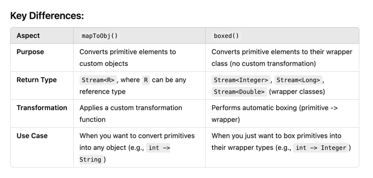

### 1)Second-highest salary
```sql
SELECT MAX(CustomerID) AS second_highest_ID
FROM Customers
WHERE CustomerID < (SELECT MAX(CustomerID) FROM Customers);
```
### Nth Highest salary(column)
```sql
SELECT * 
FROM Customers 
--GROUP BY SAL 
ORDER BY SAL DESC 
LIMIT 1 OFFSET n-1;
```

### Joining in SQL 
SQL joining is the process of combining rows from two or more tables based on a related column between them.
There are different types of joins in SQL, including:

[1] INNER JOIN: returns only the matching rows between two tables.
[2] LEFT JOIN: returns all the rows from the left table and matching rows from the right table.
[3] RIGHT JOIN: returns all the rows from the right table and matching rows from the left table.
[4] FULL OUTER JOIN: returns all the rows from both tables, with NULL values for non-matching rows.
[5] CROSS JOIN: returns the Cartesian product of the rows from both tables.
When joining tables, we specify the columns to join on using the JOIN keyword and the ON keyword. 
The syntax for an inner join is as follows:
```sql
SELECT *
FROM table1
INNER JOIN table2
ON table1.column_name = table2.column_name;
```



### Group By
The GROUP BY statement is often used with aggregate functions (COUNT(), MAX(), MIN(), SUM(), AVG()) to group,
the result-set by one or more columns.

### HAVING
The HAVING clause was added to SQL because the WHERE keyword cannot be used with aggregate functions.

### Index 
In SQL, you can create an index using the CREATE INDEX statement. An index is a data structure that improves.,
the speed of data retrieval operations on database tables by providing faster access to data.
Here's the syntax for creating an index in SQL:
```sql
CREATE INDEX index_name
ON table_name (column_name1, column_name2, ...);

CREATE INDEX idx_customers_name ON Customers (CustomerName);

SELECT * FROM Customers WHERE CustomerName = 'John Smith';
```
**Two types of indexes:-**
1) Clustered indexes
2) Non-clustered indexes

## ACID principle
The ACID principle is a set of properties that guarantee reliable processing of database transactions, ensuring the integrity and consistency of the database. ACID stands for Atomicity, Consistency, Isolation, and Durability. Let's break down each component:

1. Atomicity
   Definition: Atomicity ensures that a transaction is treated as a single, indivisible unit of work. This means that either all the operations within the transaction are completed successfully, or none of them are.
   Example: Consider a bank transfer where money is debited from one account and credited to another. Atomicity ensures that both operations (debit and credit) succeed together. If one fails, the entire transaction is rolled back, so no partial updates are made.
2. Consistency
   Definition: Consistency ensures that a transaction takes the database from one valid state to another, maintaining the integrity of the data according to predefined rules (constraints, triggers, etc.).
   Example: If a database has a constraint that ensures a bank account balance cannot go below zero, the consistency principle ensures that no transaction will violate this rule, even temporarily.
3. Isolation
   Definition: Isolation ensures that transactions are executed in isolation from each other, meaning that the operations within a transaction are not visible to other transactions until the transaction is committed. This prevents transactions from interfering with each other.
   Example: If two transactions are trying to update the same account balance simultaneously, isolation ensures that one transaction's changes are not visible to the other until the first transaction is complete, preventing conflicts and ensuring data integrity.
4. Durability
   Definition: Durability guarantees that once a transaction has been committed, it will remain in the system, even in the event of a system failure (e.g., power outage, crash).
   Example: After a successful bank transfer, the changes made to the account balances are permanently stored in the database. Even if the system crashes immediately after the transaction, the changes will be preserved when the system is restored.
   
5. Summary:
   Atomicity: All or nothing execution.
   Consistency: Valid state transitions.
   Isolation: Independent transaction execution.
   Durability: Permanent storage of committed changes.

