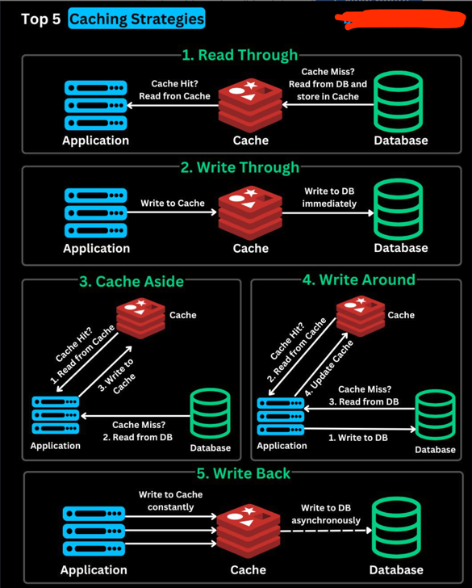

### **Top 5 Caching Strategies Explained in Depth**

Caching is a crucial technique in software systems that helps improve performance, reduce database load, and enhance user experience. Below is a detailed explanation of the five major caching strategies, including their working principles, advantages, disadvantages, and ideal use cases.

---

## **1. Read Through Caching**
### **How it Works:**
- When an application requests data, it first checks the cache.
- If the cache has the data (cache hit), it is returned immediately.
- If the cache does not have the data (cache miss), the cache itself fetches the data from the database, stores it, and then returns it to the application.
- The next time the data is requested, it is served directly from the cache.

### **Pros:**
✔ Reduces direct database queries.  
✔ Automatically keeps the cache updated with the latest requested data.  
✔ Improves read performance significantly.

### **Cons:**
✘ Slightly higher latency on cache misses.  
✘ Cache eviction can lead to frequent database hits.

### **Best for:**
- Read-heavy applications where most data access is read-oriented.
- Content Delivery Networks (CDNs).
- Social media feeds and user profile caching.

---

## **2. Cache Aside (Lazy Loading)**
### **How it Works:**
- The application first checks the cache.
- If the data is in the cache (cache hit), it is returned.
- If the data is **not** in the cache (cache miss), the application fetches it from the database, stores it in the cache, and returns it.
- The next request retrieves data directly from the cache.

### **Pros:**
✔ Reduces database load significantly when the cache is warm.  
✔ Only relevant data gets stored in the cache (no unnecessary writes).  
✔ Simple implementation without modifying the database layer.

### **Cons:**
✘ Initial cache misses cause higher latency.  
✘ Data in cache can become stale if not updated properly.  
✘ Requires explicit cache invalidation when updates occur in the database.

### **Best for:**
- Applications with a high **read-to-write ratio** (e.g., product catalogs, e-commerce systems).
- Systems where not all data needs to be cached upfront.
- Scenarios where caching should be flexible and controlled by the application.

---

## **3. Write Through Caching**
### **How it Works:**
- Data is written to both the cache and the database **at the same time**.
- When the application writes data, it first updates the cache and then ensures the database is updated.
- Reads are performed from the cache directly.

### **Pros:**
✔ Ensures strong data consistency between cache and database.  
✔ Reduces cache misses since data is pre-loaded.  
✔ Good for applications requiring real-time updates.

### **Cons:**
✘ Slower write operations because every write must go through both the cache and database.  
✘ Higher cache storage cost due to writing all data, even if it is rarely read.

### **Best for:**
- Systems where **data consistency is critical** (e.g., financial applications, banking, and billing systems).
- Applications where data needs to be **immediately available** after writing.

---

## **4. Write Around Caching**
### **How it Works:**
- The application **writes data directly to the database** (bypassing the cache).
- When a read request comes in, the cache is checked first.
- If the data is **not** in the cache (cache miss), the application fetches it from the database and then updates the cache.

### **Pros:**
✔ Reduces unnecessary cache updates when data is frequently written but not read.  
✔ Efficient for **write-heavy applications** where caching every write is unnecessary.  
✔ Prevents cache pollution with infrequently accessed data.

### **Cons:**
✘ Cache misses occur frequently for recently written data.  
✘ Higher latency on initial reads after a write.

### **Best for:**
- Write-heavy applications (e.g., **logging systems**, IoT sensor data collection).
- Systems where reads are **less frequent** than writes.

---

## **5. Write Back Caching**
### **How it Works:**
- When the application writes data, it **only updates the cache** (not the database immediately).
- The cache **asynchronously writes** the data to the database at a later time.
- This helps in batching writes and reducing database load.

### **Pros:**
✔ Very fast write operations (low latency).  
✔ Reduces database write load by batching writes.  
✔ Ideal for **high-throughput** applications where immediate persistence is not required.

### **Cons:**
✘ Risk of data loss if the cache fails before flushing data to the database.  
✘ More complex to implement due to asynchronous behavior.

### **Best for:**
- High-write, low-read systems (e.g., **real-time analytics**, gaming leaderboards).
- Applications where database write speed is a bottleneck.

---

## **Comparison Table of Caching Strategies**

| Strategy       | Read Speed | Write Speed | Complexity | Best For |
|---------------|-----------|-------------|------------|----------|
| **Read Through** | ✅ High | ⚠ Medium | ✅ Moderate | Read-heavy applications, CDNs, user profiles |
| **Cache Aside** | ✅ High (after warm-up) | ⚠ Medium | ✅ Simple | High read-to-write ratio apps (e-commerce, product catalogs) |
| **Write Through** | ✅ High | ⚠ Slower due to dual writes | ⚠ More Complex | Data consistency-critical apps (finance, transactions) |
| **Write Around** | ⚠ Lower (on first read) | ✅ Fast | ✅ Simple | Write-heavy apps (logging, sensor data) |
| **Write Back** | ⚠ Medium (due to async writes) | ✅ Fastest | ⚠ Most Complex | High-throughput, write-heavy apps (real-time analytics, gaming) |

---

## **Conclusion**
Choosing the right caching strategy depends on the use case:
- **Read-heavy applications** benefit from **Read Through** or **Cache Aside**.
- **Write-heavy applications** may need **Write Around** or **Write Back** to optimize performance.
- **Consistency-critical applications** should use **Write Through** for synchronized updates.

Each strategy has trade-offs, and in real-world applications, a combination of these strategies is often used to balance performance, consistency, and scalability. 🚀