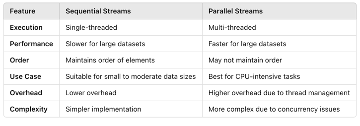
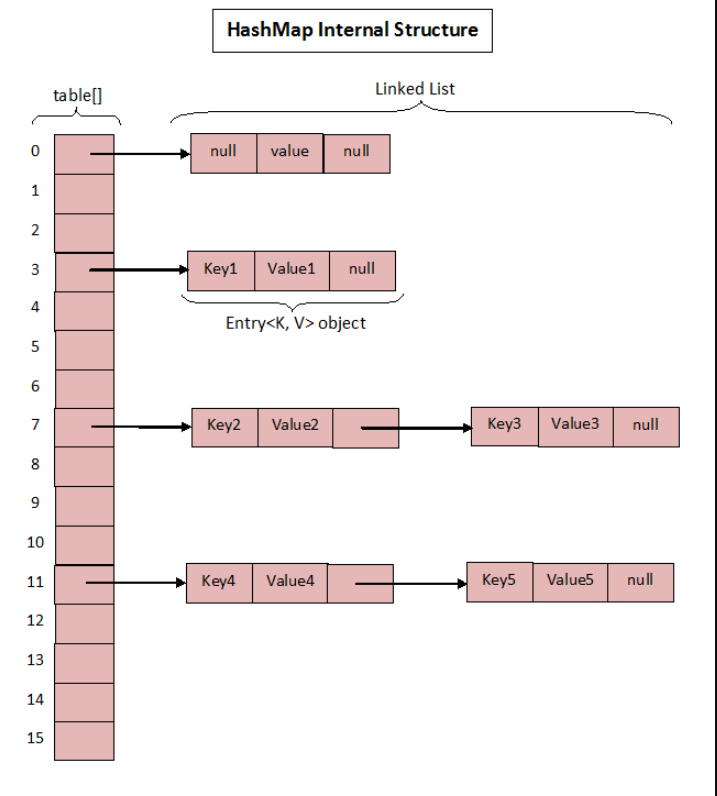

# Java 8, released in March 2014, introduced several major features that fundamentally changed the way Java programming is done.Here are some of the most notable new features introduced in Java 8:

A) Functional interfaces: Functional Interface has only one(single) abstract method. Some predefined functional interfaces as below:-
--------------
  a.1) Predicate -> test()
  a.2) Function  -> apply()
  a.3) Consumer -> accept()
  a.4) Supplier -> get()

  
B) Stream API: Streams provide a functional way to process collections of data.
--------------
C) Date & Time API: The Date/Time API provides a more comprehensive and flexible way of handling date and time as comparing than the old java.util.Date and java.util.Calendar classes.
--------------
D) Default and Static Methods: Default methods allow you to add new methods to an interface,
   without breaking the existing implementations.
--------------
E) Optional class -> Optional is a container class that may or may not contain a value,it is meant for avoid null pointer exception
--------------
F) Method References: Method references to allow you to refer to a method by its name instead of invoking it directly.
   and we represent as "::" symbol.
   
   There are 3 ways to invoke a method:

    F.1) Reference to a static method.
    F.2) Reference to an instance method.
    F.3) Reference to a constructor.
--------------
G) Lambda Expressions: enabling the functional programming and represent as "->" symbol.
--------------
H) CompletableFuture: CompletableFuture is a class that represents a future result of an asynchronous computation.
--------------
I) Parallel Streams: Parallel streams allow you to process data in parallel on multiple threads, which can improve performance for large collections.
--------------
J) The forEach() method in Java 8 is a new feature that allows you to loop over a collection and perform an action on each element in a more concise way than using a traditional for loop.
--------------
2) Difference between map() and flatMap() methods?
  
   -> map - for data transformation
   -> flatMap - for data transformation + flattening the data 
              like:- list of list, array of array, stream of stream


## Parallel Streams vs SequentialStreams


## method reference operator ::
is a shorthand notation for referring to methods or constructors without executing them.
It is primarily used in the context of functional programming, especially with lambda expressions. 
*  Benefits
   Conciseness: Makes code shorter and more readable compared to using lambda expressions.
   Clarity: Clearly indicates that a method is being referenced rather than executed.

## HashMap Internal Implementation
The internal implementation of HashMap in Java 8 significant changes to improve performance,
particularly in scenarios with high hash collisions.

> Buckets and Nodes:
  * A HashMap stores key-value pairs in a bucket using an array of Node objects, where each node represents a linked list.

  * The Node class implements the Map.Entry interface and contains
```java
static class Node<K,V> implements Map.Entry<K,V> {
    final int hash;
    final K key;
    V value;
    Node<K,V> next;
}
```
> Collision Handling:

* Collisions occur when multiple keys hash to the same bucket.
* In Java 8, collisions are first resolved with a linked list, as in earlier versions.
* If the list grows beyond a threshold (default: 8), the linked list is converted into a red-black tree for faster lookups (O(log n) instead of O(n)).

> Key Methods:

* put(K key, V value): Calculates the bucket index using the hash, checks for collisions, and inserts the key-value pair.
* get(Object key): Computes the hash, finds the bucket, and retrieves the value by comparing keys using equals().

> Key Features Introduced in Java 8:
* Red-Black Tree for Collision Resolution: Improved efficiency in case of high collisions.
* Improved Hashing: A better secondary hash function reduces the chances of poor distribution.
* Performance Optimization: Average-case complexity remains O(1), with worst-case reduced to O(log n) in high-collision scenarios.