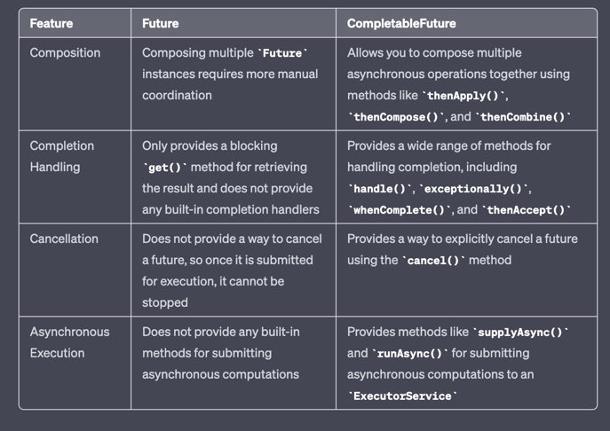

### What are differences between submit() and execute() methods in ExecutorService?
-> submit() and execute().
Both methods execute tasks asynchronously using a thread pool managed by the ExecutorService. 
However, there are some differences between the two methods.

1) Return value: To submit() method returns a Future object that can be used to retrieve the result of the task 
execution or to cancel the task. and execute() method does not return anything.

2) Task type: To submit() method can accept tasks that implement either the Callable or Runnable interfaces, 
while the execute() method can only accept tasks that implement the Runnable interface.

3) Blocking behavior: To submit() method is a blocking call that waits for the task to complete and return its result
before returning. The execute() method is a non-blocking call that simply submits the task for execution and returns immediately.

### Difference between  newCachedThreadPool vs newFixedThreadPool
Both newCachedThreadPool and newFixedThreadPool are factory methods in the java.util.concurrent.Executors class 
that create thread pools. However, they differ in their behavior and use cases.

-> newCachedThreadPool() creates a thread pool that will automatically adjust its size based on the current workload.
It starts with zero threads and creates new threads as needed to handle incoming tasks.
If a thread remains idle for 60 seconds, it is terminated and removed from the pool.
This makes it ideal for scenarios where you have a large number of short-lived tasks and you want to optimize
the use of system resources.

-> newFixedThreadPool(int nThreads) creates a thread pool with a fixed number of threads.
Once all threads are in use, new tasks are queued until a thread becomes available.
This makes it ideal for scenarios where you have a fixed amount of resources to dedicate to task processing, 
such as when you are processing a large number of long-running tasks.

-> In summary, the newCachedThreadPool() is best suited for situations where you have a lot of short-lived tasks and 
want to optimize resource usage, while newFixedThreadPool(int nThreads) is better for scenarios
where you have a fixed amount of resources to process a large number of long-running tasks.

**=>CyclicBarrier vs countdown-latch difference**

*) Usage: CyclicBarrier is used to synchronize a group of threads at a specific point, where each thread waits for other
threads to reach the same point, and then all threads can proceed together. 
CountDownLatch is used to synchronize one or more threads by waiting for them to complete a set of tasks.

*) Constructor: CyclicBarrier takes two arguments: the number of threads that need to reach the barrier and a Runnable that is
    executed when all threads reach the barrier.
    CountDownLatch takes a single argument that represents the number of events that need to occur before the latch is released.

### Difference between Future and CompletableFuture?
 -> a CompletableFuture is an extension of Future that allows for more advanced composition and chaining of asynchronous computations.
 
 
### what is implicit or explicit lock
In Java, locks are mechanisms used to manage access to shared resources by multiple threads to prevent race conditions and ensure thread safety. Locks can be either explicit or implicit, and here's the difference:

Implicit Lock (or Monitor Lock)

* Definition: Implicit locks are those that are automatically acquired by the JVM when a thread enters a synchronized block or method.
* Usage: When you use the synchronized keyword, the lock is implicitly acquired on the object used in the synchronization.
```java
public class SynchronizedLock{
public synchronized void someMethod() {
// Thread acquires lock on 'this' object (implicit lock)
// Critical section
}

//Or

public void someMethod() {
synchronized(this) {
// Thread acquires lock on 'this' object (implicit lock)
// Critical section
}
}
```
* Lock Release: The lock is automatically released when the synchronized block or method exits, either normally or due to an exception.

Explicit Lock
* Definition: Explicit locks are those that the developer manually acquires and releases using the Lock interface from the java.util.concurrent.locks package.
* Usage: You have more control over the locking mechanism, including the ability to try acquiring the lock without blocking or with a timeout.

```java
import java.util.concurrent.locks.Lock;
import java.util.concurrent.locks.ReentrantLock;

public class SomeClass {
private final Lock lock = new ReentrantLock();

    public void someMethod() {
        lock.lock();  // Acquiring the lock explicitly
        try {
            // Critical section
        } finally {
            lock.unlock();  // Releasing the lock explicitly
        }
    }
}
```

* Flexibility: Explicit locks offer more flexible locking mechanisms compared to implicit locks, such as reentrant locking, 
  interruption locking, and the ability to attempt locking.

### Key Differences:
1. Control: Explicit locks give more control over locking, while implicit locks are managed by the JVM.
2. Reentrancy: Both synchronized (implicit locks) and ReentrantLock (explicit locks) are reentrant, meaning a thread can acquire the same lock multiple times without deadlocking itself.
3. Timeouts: Explicit locks can be used with timeouts, whereas implicit locks cannot.