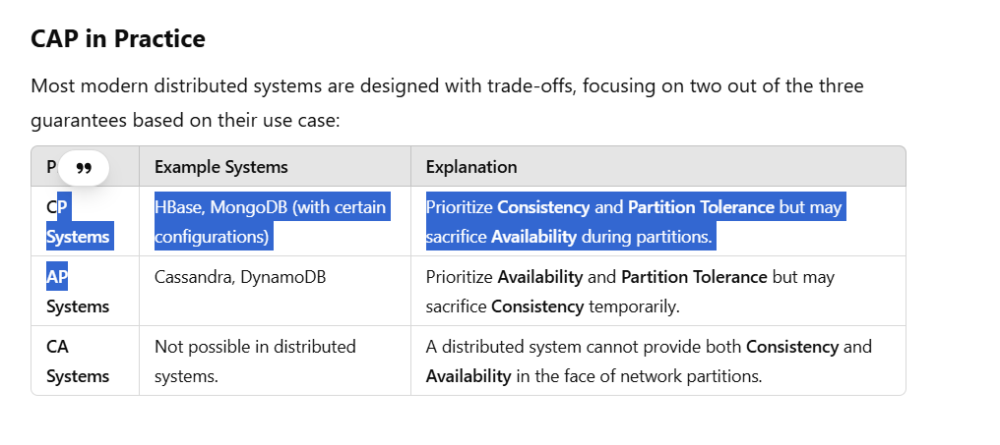

DAO layer to Service layer to controller to Browser

1). What is spring boot?
Ans). Spring boot is an extension of spring framework used to rapid application development.
      It has extra support of autoconfiguration, embedded application server like "tomcat" and "jetty" and "starter" etc.

2). What is Authentication and Authorisation?
 ->in server side Authentication checks user is valid or not(401 HTTP ERROR CODE) by credential. and 
    Authorisation checks user is authorized or not(403 HTTP ERROR CODE) for particular resources.
 
3). How to secure your RestAPI?  
 -> There are a multiple way to secure restApi:-
   1) Basic Authentication (I used in my project)
   2) Oauth
   3) JWT
   
4) What is Actuator?
 -> Basically Actuator is use for Monitoring health of our application.

5) Swagger API Documentation?
 -> OpenAPI 3 Documentation used in my project to expose rest endPoint to the client side.
 
6) What DI (Dependency Injection)?
-> Dependency Injection is injecting one bean to another bean for further process. there are three types:-
   1) Setter Injection
   2) Constructor Intention
   3) Field Injection 
   
7) What is IOC?
-> IOC stands for inversion of control is design pattern it's a implementation of Dependency Injections.
   => OR == Spring IoC is the mechanism to achieve loose-coupling between Objects dependencies. 

Q). ORM tool?
Ans). Object-relational mapping:  used to access data from the database server. 

Q). Path variable vs Request param vs Request body...?
Ans). Path variable: It is used to extract values from the URL/URI path where value enclosed with "{}" braces.(@PathVariable)
      Request param: It is used to extract values from the query string.(@RequestParam)
      Request body: It is used to extract the entire request body from an incoming HTTP post request.(@RequestBody)
      
**Query-String:** 
=> Consists of one or more key-value pairs separated by an ampersand(&) symbol. The key is the name of the parameter,
and the value is the data being passed. 

**q)Diff between interceptor vs filter?**
Interceptors operate on the method invocation level, 
while filters operate on the request/response level in a web application.

**CAP theorem**

* Applications

Understanding CAP theorem helps architects and developers design systems based on specific requirements:

  * For banking or financial transactions, Consistency is often prioritized (CP).
  * For user-facing applications like social media, Availability is often prioritized (AP).

The CAP theorem emphasizes the importance of identifying trade-offs in distributed system design to meet business needs effectively.