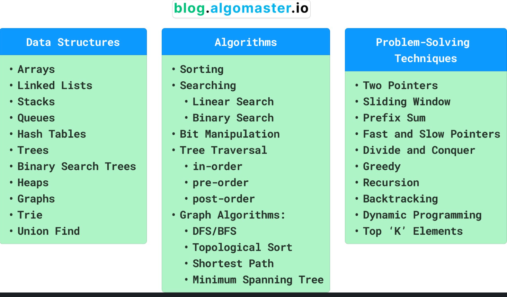

# Read2024

### Data Structure, Algorithms and Problem-solving Techniques

[1. Language Fundamentals.pdf](DSA%2Ftheory%2Fpdf%2F1.%20Language%20Fundamentals.pdf)
[2. OPERATORS _ ASSIGNMENTS.pdf](DSA%2Ftheory%2Fpdf%2F2.%20OPERATORS%20_%20ASSIGNMENTS.pdf)
[3.  Flow Control.pdf](DSA%2Ftheory%2Fpdf%2F3.%20%20Flow%20Control.pdf)
[4.  Declaration and Access Modifiers.pdf](DSA%2Ftheory%2Fpdf%2F4.%20%20Declaration%20and%20Access%20Modifiers.pdf)
[5. OOPS.pdf](DSA%2Ftheory%2Fpdf%2F5.%20OOPS.pdf)
[6. Exception Handling.pdf](DSA%2Ftheory%2Fpdf%2F6.%20Exception%20Handling.pdf)
[7. Multi Threading.pdf](DSA%2Ftheory%2Fpdf%2F7.%20Multi%20Threading.pdf)
[8. Multi Threading Enhancements.pdf](DSA%2Ftheory%2Fpdf%2F8.%20Multi%20Threading%20Enhancements.pdf)
[9. InnerClasses.pdf](DSA%2Ftheory%2Fpdf%2F9.%20InnerClasses.pdf)
[10. java.lang package.pdf](DSA%2Ftheory%2Fpdf%2F10.%20java.lang%20package.pdf)
[11. File IO Package.pdf](DSA%2Ftheory%2Fpdf%2F11.%20File%20IO%20Package.pdf)
[12. Serialization.pdf](DSA%2Ftheory%2Fpdf%2F12.%20Serialization.pdf)
[13. Regular Expression.pdf](DSA%2Ftheory%2Fpdf%2F13.%20Regular%20Expression.pdf)
[14 Collections Frame Work.pdf](DSA%2Ftheory%2Fpdf%2F14%20Collections%20Frame%20Work.pdf)
[15. Generics.pdf](DSA%2Ftheory%2Fpdf%2F15.%20Generics.pdf)
[16 Garbage Collection.pdf](DSA%2Ftheory%2Fpdf%2F16%20Garbage%20Collection.pdf)
[17. ENUM.pdf](DSA%2Ftheory%2Fpdf%2F17.%20ENUM.pdf)
[20.  Assertions.pdf](DSA%2Ftheory%2Fpdf%2F20.%20%20Assertions.pdf)
[21. JVM Architecture.pdf](DSA%2Ftheory%2Fpdf%2F21.%20JVM%20Architecture.pdf)