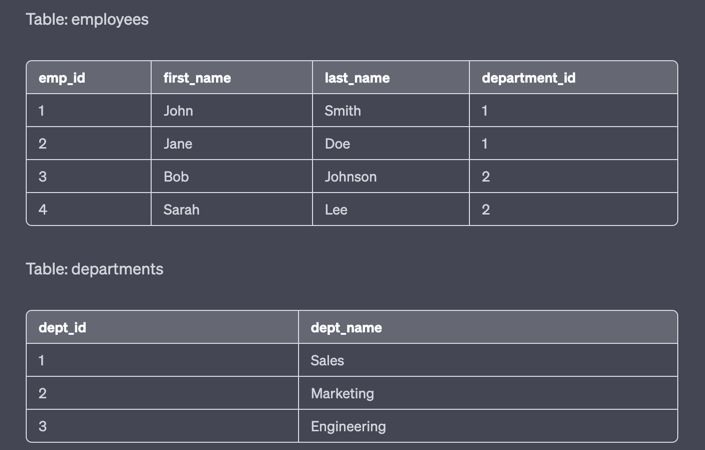
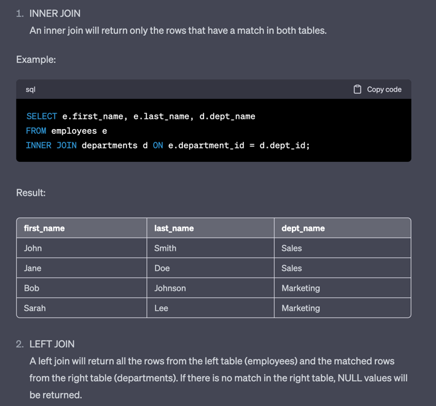
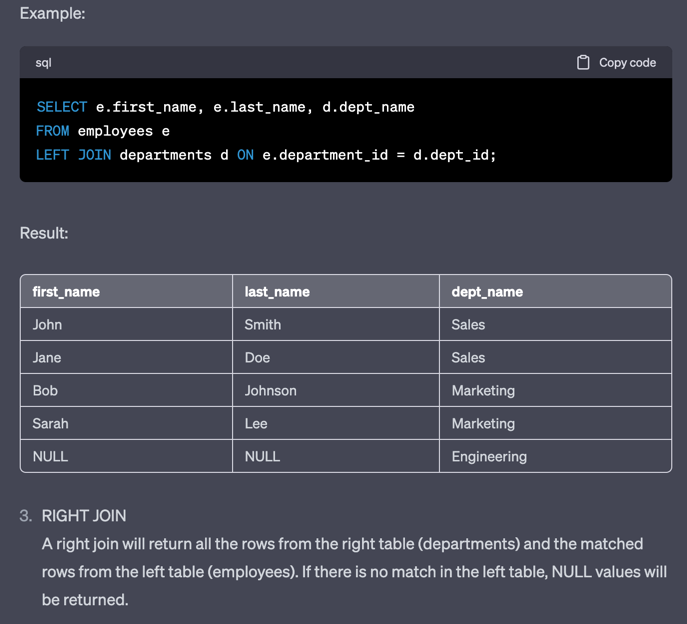
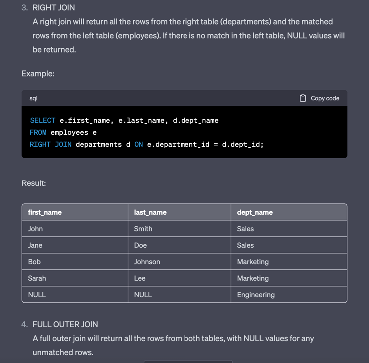
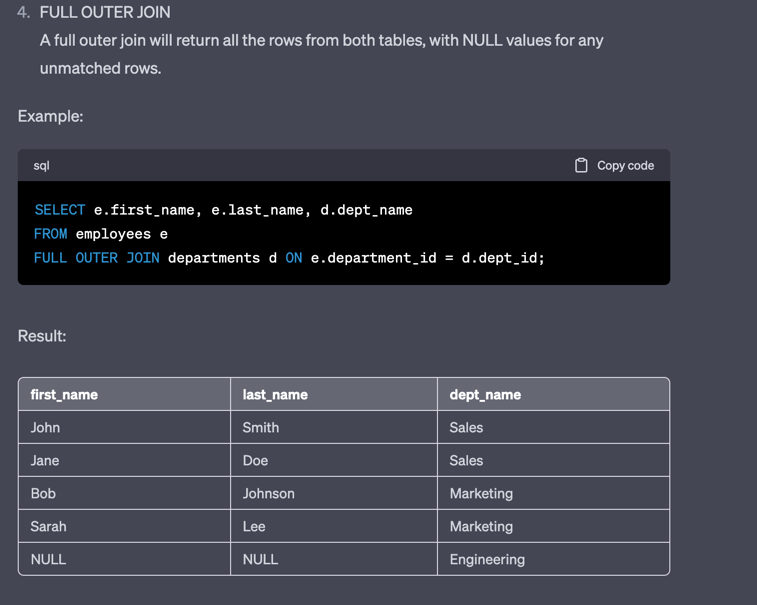

### 1)Second-highest salary
```sql
SELECT MAX(CustomerID) AS second_highest_ID
FROM Customers
WHERE CustomerID < (SELECT MAX(CustomerID) FROM Customers);
```
### Nth Highest salary(column)
```sql
SELECT * 
FROM Customers 
GROUP BY CustomerID 
ORDER BY CustomerID DESC 
LIMIT 1 OFFSET n-1;
```

### Joining in SQL 
SQL joining is the process of combining rows from two or more tables based on a related column between them.
There are different types of joins in SQL, including:

[1] INNER JOIN: returns only the matching rows between two tables.
[2] LEFT JOIN: returns all the rows from the left table and matching rows from the right table.
[3] RIGHT JOIN: returns all the rows from the right table and matching rows from the left table.
[4] FULL OUTER JOIN: returns all the rows from both tables, with NULL values for non-matching rows.
[5] CROSS JOIN: returns the Cartesian product of the rows from both tables.
When joining tables, we specify the columns to join on using the JOIN keyword and the ON keyword. 
The syntax for an inner join is as follows:
```sql
SELECT *
FROM table1
INNER JOIN table2
ON table1.column_name = table2.column_name;
```






### Group By
The GROUP BY statement is often used with aggregate functions (COUNT(), MAX(), MIN(), SUM(), AVG()) to group,
the result-set by one or more columns.

### HAVING
The HAVING clause was added to SQL because the WHERE keyword cannot be used with aggregate functions.

### Index 
In SQL, you can create an index using the CREATE INDEX statement. An index is a data structure that improves.,
the speed of data retrieval operations on database tables by providing faster access to data.
Here's the syntax for creating an index in SQL:
```sql
CREATE INDEX index_name
ON table_name (column_name1, column_name2, ...);

CREATE INDEX idx_customers_name ON Customers (CustomerName);

SELECT * FROM Customers WHERE CustomerName = 'John Smith';
```
**Two types of indexes:-**
1) Clustered indexes
2) Non-clustered indexes

